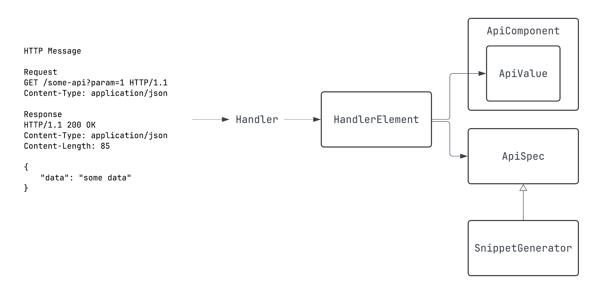

# DSL Interface

This section describes the interfaces designed to provide DSL capabilities.

## Overall Structure



In Spring MVC, HTTP requests and responses are mapped via handlers.

The components that make up HTTP requests and responses (query parameters, path variables, body, etc.) 
are mapped to the handler's annotations, parameters, and return types.

Spring REST Docs helps document these components 
by providing a way to describe the fields that make up each component and integrate them into documentation.

In Spring REST Docs, fields within each component are represented by `AbstractDescriptor`, 
which is then combined into a `Snippet`.
The combined `Snippet` is ultimately handled by the `document` function, which, together with the document's identifier,
processes the API call results to finally generate snippets in formats like Asciidoc.

This library offers DSL capabilities while aligning with Spring REST Docs' structure
by providing four main interfaces:

- `ApiField`, corresponding to `AbstractDescriptor`
- `ApiComponent`, corresponding to `Snippet`
- `ApiSpec`, which integrates all `Snippet`s for a single API
- `SnippetGenerator`, which converts the written DSL into `Snippet`s.

Additionally, there's an interface called `HandlerElement` that doesn’t provide a DSL
but captures the necessary information from the handler’s elements and converts them into `ApiField`.

Let’s look at these four interfaces using a simple HTTP API example:

```
HTTP Message

Request
GET /some-api?id=abc&num=5 HTTP/1.1
Content-Type: application/json

Response 
HTTP/1.1 200 OK
Content-Type: application/json
Content-Length: 85
{
    "data": "some data"
}
```

Given an API communicating with messages like the one above,
the components and fields extracted are as follows:

| Component       | Field   |
|-----------------|---------|
| Query Parameter | id, num |
| Response Body   | data    |

`ApiField` is the DSL interface that allows you to document the fields listed in the table above.

The `ApiComponent` interface integrates these `ApiField` properties by component.

The `ApiComponent` generated is then handled by a suitable `SnippetGenerator` in the `ApiSpec` implementation,
allowing the DSL functions to be invoked.

Once an `ApiComponent` is created, the `ApiSpec` implementation will implement the appropriate `SnippetGenerator` for each component, 
allowing you to call DSL functions.

Let’s examine the `ApiComponent` implementations and `ApiField` properties generated after mapping the API to a handler:

```kotlin
public object ExampleApiResponseBody : BodyComponent(false) {  
  public val `data`: JsonField = JsonField("data", false, 0)  
  
  init {  
    addFields(  
      `data`  
    )  
  }  
}  
  
public object ExampleApiQueryParameter : ApiComponent<ParameterDescriptor>() {  
  public val id: QueryParameterField = QueryParameterField("id")  
  
  public val num: QueryParameterField = QueryParameterField("num")  
  
  init {  
    addFields(  
      `id`,  
      `num`  
    )  
  }  
}
```

Two `ApiComponent` implementations, `ExampleApiResponseBody` and `ExampleApiQueryParameter`, were generated.
Each holds the fields as `ApiField`-typed properties corresponding to their respective components.

These generated `ApiComponent`s are then declared as type parameters for `SnippetGenerator` implementations,
which are invoked in the `ApiSpec` implementation to call the appropriate [DSL functions](#http-component-dsl).

Let's now look at the `ApiSpec` generated:

```kotlin
public data class ExampleApiSpec(  
  override val identifier: String,  
) : ApiSpec,  
    ResponseBodySnippetGenerator<ExampleApiResponseBody>,  
    QueryParameterSnippetGenerator<ExampleApiQueryParameter> {  
  override val snippets: MutableList<Snippet> = mutableListOf()  
  
  override fun getResponseBodyApiComponent(): ExampleApiResponseBody = ExampleApiResponseBody  
  
  override fun getQueryParameterApiComponent(): ExampleApiQueryParameter = ExampleApiQueryParameter  
  
  override fun addSnippet(generatedSnippet: Snippet) {  
    this.snippets.add(generatedSnippet)  
  }  
  
  override fun addSnippets(generatedSnippets: List<Snippet>) {  
    this.snippets.addAll(generatedSnippets)  
  }  
}
```

This HTTP API only includes query parameters and a response body, so the `ApiSpec` implementation,
`ExampleApiSpec`, implements the corresponding `SnippetGenerator` interfaces.

Each `SnippetGenerator` implementation has appropriately named functions.
For example, `ResponseBodySnippetGenerator` has the `responseBody` function,
and `QueryParameterSnippetGenerator` has the `queryParameters` function:

```kotlin
interface QueryParameterSnippetGenerator<C: ApiComponent<ParameterDescriptor>> : SnippetGenerator {

    fun queryParameters(dsl: C.() -> Unit) {
        ...
    }
    ...
}

interface ResponseBodySnippetGenerator<C: BodyComponent> : SnippetGenerator {

    fun responseBody(dsl: C.(element: C) -> Unit) {
        ...
    }
    ...
}
```

These functions take as parameters functions that have the type declared in the type parameter as the receiver.
Since the type parameter is of `ApiComponent` type and `ApiComponent` contains `ApiField` properties,
you can call [Component DSL](#component-dsl) functions using those properties within the function block.

## HTTP Component DSL

As mentioned earlier, the HTTP components constituting requests and responses can be documented
using DSL through the functions of `SnippetGenerator` implementations.

| HTTP Component  | Implementation                        | Function Name      |
|-----------------|----------------------------------------|--------------------|
| Request Path Variables | `PathVariableSnippetGenerator`     | `pathVariables`    |
| Request Parameters  | `QueryParameterSnippetGenerator`   | `queryParameters`  |
| Request Headers      | `RequestHeaderSnippetGenerator`    | `requestHeaders`   |
| Request Cookies      | `RequestCookieSnippetGenerator`    | `requestCookies`   |
| Request Parts      | `RequestPartSnippetGenerator`      | `requestParts`     |
| Request Body      | `RequestBodySnippetGenerator`      | `requestBody`      |
| Response Headers      | `ResponseHeaderSnippetGenerator`   | `responseHeaders`  |
| Response Cookies      | `RequestCookieSnippetGenerator`    | `responseCookies`  |
| Response Body      | `ResponseBodySnippetGenerator`     | `responseBody`     |

If an API includes request headers and both request and response bodies,
the `ApiSpec` implementation will implement `RequestHeaderSnippetGenerator`, `RequestBodySnippetGenerator`,
and `ResponseBodySnippetGenerator`. Consequently, you can call the DSL functions as follows:

```kotlin
document(SimpleUsageApiSpec("simple-usage")) {
    requestHeaders { ... }
    requestBody { ... }
    responseBody { ... }
}
```

## Component DSL

As mentioned, the fields constituting an HTTP component are handled as `ApiField` properties,
corresponding to Spring REST Docs' `AbstractDescriptor`.

```kotlin
responseBody { 
    result means "Whether the login was successful" typeOf STRING formattedAs "Success or Failure"
    status means "User's status" typeOf ENUM(UserStatus::class)
}
```

This example demonstrates how to document the `result` and `status` fields using the DSL.
The DSL uses infix notations, and all functions return `ApiField` itself, enabling chaining.

### Available Infix Notations

| Function Name     | Description                                                                                         | Parameter Type    |
|-------------------|-----------------------------------------------------------------------------------------------------|-------------------|
| `means`           | Provides a description for the element. Corresponds to `AbstractDescriptor.description`.            | `String`          |
| `typeOf`          | Specifies the type of the element. Corresponds to `org.springframework.restdocs.payload.FieldDescriptor.type`. If the type isn't `FieldDescriptor`, it is passed to the `formattedAs` function. | `ApiFieldType`    |
| `formattedAs`     | Adds the given `format` string to the `AbstractDescriptor.attributes` with the `format` key.         | `String`          |
| `isIgnored`       | Ignores the element in the documentation. Corresponds to `org.springframework.restdocs.snippet.IgnorableDescriptor.ignored`. | `Boolean`         |
| `isOptional`      | Marks the element as optional. Corresponds to `optional()` in each `AbstractDescriptor` implementation. | `Boolean`      |

### ApiFieldType

This class is a wrapper around `JsonFieldType` and is designed to simplify the documentation of commonly used formats.

```kotlin
open class ApiFieldType(
    val fieldType: JsonFieldType,
    open val customFormat: String? = null
)

data object ARRAY: ApiFieldType(JsonFieldType.ARRAY)
data object BOOLEAN: ApiFieldType(JsonFieldType.BOOLEAN)
data object OBJECT: ApiFieldType(JsonFieldType.OBJECT)
data object NUMBER: ApiFieldType(JsonFieldType.NUMBER)
data object NULL: ApiFieldType(JsonFieldType.NULL)
data object STRING: ApiFieldType(JsonFieldType.STRING)
data object ANY: ApiFieldType(JsonFieldType.VARIES)
data object DATE: ApiFieldType(JsonFieldType.STRING, "yyyy-MM-dd")
data object DATETIME: ApiFieldType(JsonFieldType.STRING, "yyyy-MM-ddTHH:mm:ss")
```

Each `ApiFieldType` implementation adds the value of the `customFormat` property as a format attribute
when implementing the `typeOf` function.

```kotlin
override infix fun typeOf(type: ApiFieldType): JsonField {
    descriptor.type(type.fieldType)
    if (type.customFormat != null) descriptor.format(type.customFormat!!)
    return this
}
```

This function is implemented in `JsonField`. For objects like `DATE` and `DATETIME` that have a `customFormat`,
the corresponding value is added to the format attribute.

```kotlin
data object UUID: ApiFieldType(JsonFieldType.STRING, "UUID format")
```

If there are custom formats frequently used in your project,
you can extend `ApiFieldType` and create your own, like the example above.

```kotlin
data class ENUM<T : Enum<T>>(
    val enums: Collection<T>,
    override val customFormat: String? = enums.joinToString(", "),
) : ApiFieldType(JsonFieldType.STRING) {

    constructor(
        clazz: KClass<T>,
        filter: (T.() -> Boolean)? = null
    ) : this(
        enums = clazz.java.enumConstants.asList().let {
            if (filter != null) it.filter(filter) else it
        },
    )

}
```

A convenience object is also provided for `Enum` types, making it easier to document them.

```kotlin
enumValue means "enum" typeOf ENUM(listOf(EnumExample.A, EnumExample.B))
enumValue means "enum" typeOf ENUM(EnumExample::class) { isA() || isB() }
```

Two constructors allow you to specify possible values. The first line provides a list of possible values directly,
while the second line filters the possible values by calling functions defined in the Enum.

### Nested JSON Fields

JSON fields can be simple values like strings or numbers, 
but they can also represent nested objects or arrays of objects.

Spring REST Docs allows you to document these nested fields using `subsectionWithPath` or `beneathPath`. 
However, this library provides a more elegant way to document nested fields.

If a field is nested, it will be declared as a `NestedJsonField` or `NestedArrayJsonField` property. 
`NestedArrayJsonField` extends `NestedJsonField`, and this class supports nested object DSL through the `of` function:

```kotlin
responseBody { 
    result means "Whether the login was successful" typeOf STRING formattedAs "Success or Failure"
    status means "User's status" typeOf ENUM(ExampleController.SimpleResponse.UserStatus::class)
    detail means "User's detail information" typeOf OBJECT of {
        userId means "User's id" typeOf STRING
        password means "User's password" typeOf STRING isIgnored true
        profileMessage means "User's profile message" typeOf STRING isOptional true
    }
}
```

In the example above, the `detail` field is a nested object field.
You can document its fields using the `of` function, as shown.

```kotlin
infix fun of(nestedFieldDetailDsl: E.() -> Unit) {
    nestedElement.nestedFieldDetailDsl()
}
```

The `of` function takes a function as a parameter, 
where the type parameter `E` is an `ApiComponent` implementation 
that holds the nested object's fields as `JsonField` properties.

Let’s look at the generated `ApiComponent` implementation:

```kotlin
public object SimpleUsageApiResponseBody : BodyComponent(false) {

  ...
  
  public val detail: NestedJsonField<SimpleDetail_0> = NestedJsonField("detail", SimpleDetail_0,
      false, 0)

  ...
  
  public object SimpleDetail_0 : BodyComponent(false) {
    public val userId: JsonField = JsonField("userId", false, 0)

    public val password: JsonField = JsonField("password", false, 0)

    public val profileMessage: JsonField = JsonField("profileMessage", false, 0)

    ...
    
  }
}
```

The `detail` property is declared as a `NestedJsonField`, with `SimpleDetail_0` passed as the type parameter.

`SimpleDetail_0` is an implementation of `BodyComponent`, holding the nested fields as properties.
As with other JSON data, you can use DSL to document these fields.