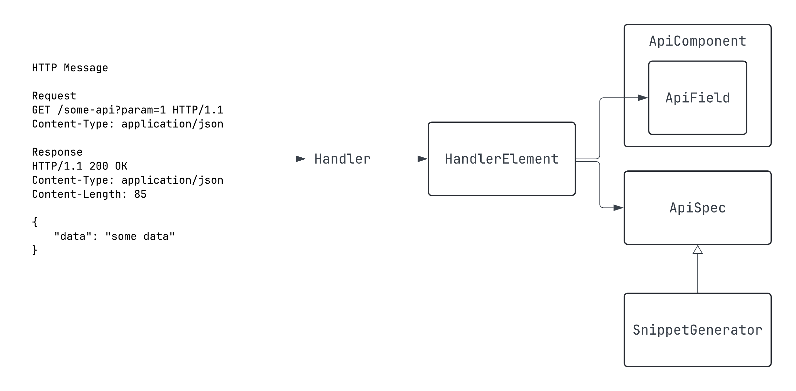

# DSL 인터페이스

DSL을 제공할 수 있도록 설계된 인터페이스들에 대해서 기술합니다.

## 전체 구조



Spring MVC는 핸들러를 통해 HTTP 요청과 응답을 매핑합니다.
그리고 HTTP 요청과 응답을 구성하는 컴포넌트들(쿼리 파라미터, 경로변수, 바디 등)은 핸들러의 어노테이션, 파라미터, 리턴타입으로 매핑합니다.
그리고 Spring REST Docs는 각 컴포넌트들을 구성하는 필드에 대해 설명을 작성하고, 이를 통합하여 문서화 할 수 있도록 도와줍니다.

Spring REST Docs에서는 각 컴포넌트들을 구성하는 필드에 대한 설명을 `AbstractDescriptor`로서 표현하고, 이를 `Snippet`으로 통합하고 있습니다.
그리고 통합된 `Snippet`은 문서의 식별자(identifier)와 함께 `document`함수를 통해
API 호출 결과를 핸들링하여 최종적으로 asciidoc 등의 형식으로 스니펫을 생성합니다.

이 라이브러리는 DSL을 제공함과 동시에 이러한 Spring REST Docs의 구조에 맞추기 위해  
`AbstractDescriptor`에 대응되는 `ApiField`, `Snippet`에 대응되는 `ApiComponent`,
그리고 하나의 API에 대해 모든 `Snippet`을 통합하는 `ApiSpec`,
작성된 DSL을 `Snippet`으로 변환시켜주는 `SnippetGenerator` 총 4가지의 인터페이스를 만들어 놓았습니다.

그리고 DSL을 제공하진 않지만, 핸들러를 구성하는 요소들을 `ApiField`로 변환할 수 있도록
각 요소의 정보를 담는 `HandlerElement`라는 인터페이스도 있습니다.

하나의 HTTP API 예시를 들어 이 4가지 인터페이스에 대해 쉽게 파악해봅시다.
```
HTTP Message

Request
GET /some-api?id=abc&num=5 HTTP/1.1
Content-Type: application/json

Response 
HTTP/1.1 200 OK
Content-Type: application/json
Content-Length: 85
{
    "data": "some data"
}
```
위와 같은 메시지로 통신되는 API가 있다고 해봅시다. 여기서 메시지를 구성하는 컴포넌트와 필드를 추출하면 아래와 같습니다.

| 컴포넌트 | 필드      |
|---------|---------|
| 쿼리 파라미터 | id, num |
| 응답 바디 | data    |

`ApiField`는 위 표에 작성된 필드에 대해 문서를 작성할 수 있는 DSL 인터페이스 입니다.

그리고 이러한 `ApiField`타입의 프로퍼티를 각 컴포넌트 별로 통합해놓는 인터페이스가 바로 `ApiComponent`입니다.

그리고 생성된 `ApiComponent`가 어떤 컴포넌트인지에 따라 적합한 `SnippetGenerator`를 `ApiSpec` 구현체에서 구현하여 DSL 함수를 호출할 수 있게 됩니다.

확인을 위해 API를 핸들러로 매핑한 후 생성되는 `ApiComponent`구현체와 `ApiField`타입의 프로퍼티를 확인해봅시다.
```kotlin
public object ExampleApiResponseBody : BodyComponent(false) {  
  public val `data`: JsonField = JsonField("data", false, 0)  
  
  init {  
    addFields(  
      `data`  
    )  
  }  
}  
  
public object ExampleApiQueryParameter : ApiComponent<ParameterDescriptor>() {  
  public val id: QueryParameterField = QueryParameterField("id")  
  
  public val num: QueryParameterField = QueryParameterField("num")  
  
  init {  
    addFields(  
      `id`,  
      `num`  
    )  
  }  
}
```
`ExampleApiResponseBody`, `ExampleApiQueryParameter`총 두 개의 `ApiComponent`구현체가 생성되었으며,
각각 필드를 `ApiField` 구현체 타입의 프로퍼티로 가지고 있는 것을 확인할 수 있습니다.

그리고 이렇게 생성된 `ApiComponent`들은 `SnippetGenerator`구현체의 타입 파라미터로 선언되고,
이를 `ApiSpec`구현체에서 구현하여 각 컴포넌트 별로 적합한 [DSL 함수](#http-컴포넌트-dsl)를 호출할 수 있게 됩니다.

한번 그 아래에 생성된 `ApiSpec`을 살펴봅시다.
```kotlin
public data class ExampleApiSpec(  
  override val identifier: String,  
) : ApiSpec,  
    ResponseBodySnippetGenerator<ExampleApiResponseBody>,  
    QueryParameterSnippetGenerator<ExampleApiQueryParameter> {  
  override val snippets: MutableList<Snippet> = mutableListOf()  
  
  override fun getResponseBodyApiComponent(): ExampleApiResponseBody = ExampleApiResponseBody  
  
  override fun getQueryParameterApiComponent(): ExampleApiQueryParameter = ExampleApiQueryParameter  
  
  override fun addSnippet(generatedSnippet: Snippet) {  
    this.snippets.add(generatedSnippet)  
  }  
  
  override fun addSnippets(generatedSnippets: List<Snippet>) {  
    this.snippets.addAll(generatedSnippets)  
  }  
}
```
해당 HTTP API는 쿼리 파라미터, 응답 바디만을 가지고 있었기 때문에 이에 상응하는 `SnippetGenerator`구현체를 `ApiSpec`구현체인 `ExampleApiSpec`에서 구현하고 있습니다.

`SnippetGenerator` 구현체는 각각 적합한 이름의 함수를 가지고 있으며, 위 예시에 등장하는 `ResponseBodySnippetGenerator`는 `responseBody`,
`QueryParameterSnippetGenerator`는 `queryParameters`라는 이름의 함수를 가집니다.
```kotlin
interface QueryParameterSnippetGenerator<C: ApiComponent<ParameterDescriptor>> : SnippetGenerator {

    fun queryParameters(dsl: C.() -> Unit) {
        ...
    }
    ...
}

interface ResponseBodySnippetGenerator<C: BodyComponent> : SnippetGenerator {

    fun responseBody(dsl: C.(element: C) -> Unit) {
        ...
    }
    ...
}
```

이 함수들은 모두 타입 파라미터로 선언된 타입을 수신객체로 가지는 함수를 파라미터로 가지고 있습니다.
이 타입 파라미터는 `ApiComponent` 타입이며, `ApiComponent`는 `ApiField`타입의 프로퍼티를 멤버로 가지고 있기 때문에
해당 함수 블록에서 `ApiField`타입의 프로퍼티를 통해 [필드 DSL](#필드-dsl)을 호출할 수 있게 됩니다.

## HTTP 컴포넌트 DSL
앞서 살펴봤듯 HTTP 요청 및 응답을 구성하는 HTTP 컴포넌트들은 `SnippetGenerator` 구현체의 함수를 통해 DSL을 작성할 수 있습니다.

| HTTP 컴포넌트  | 구현체                              | 함수명               |
|------------|----------------------------------|-------------------|
| 요청 경로변수    | `PathVariableSnippetGenerator`   | `pathVariables`   |
| 요청 파라미터    | `QueryParameterSnippetGenerator` | `queryParameters` |
| 요청 헤더      | `RequestHeaderSnippetGenerator`  | `requestHeaders`  |
| 요청 쿠키      | `RequestCookieSnippetGenerator`  | `requestCookies`  |
| 요청 파트      | `RequestPartSnippetGenerator`    | `requestParts`    |
| 요청 바디      | `RequestBodySnippetGenerator`    | `requestBody`     |
| 응답 헤더      | `ResponseHeaderSnippetGenerator` | `responseHeaders` |
| 응답 쿠키      | `RequestCookieSnippetGenerator`  | `responseCookies` |
| 응답 바디      | `ResponseBodySnippetGenerator`   | `responseBody`    |

만약 API를 구성하는 컴포넌트가 요청 헤더, 요청 및 응답 바디만 있다면`ApiSpec`의 구현체는 
`RequestHeaderSnippetGenerator`, `RequestBodySnippetGenerator`, `ResponseBodySnippetGenerator`를 구현하게 됩니다.
따라서 아래와 같이 DSL 함수를 호출할 수 있게 됩니다.
```kotlin
document(SimpleUsageApiSpec("simple-usage")) {
    requestHeaders { ... }
    requestBody { ... }
    responseBody { ... }
}
```

## 필드 DSL
앞서 살펴봤듯 HTTP 컴포넌트를 구성하는 필드는 `ApiField`타입의 프로퍼티로 처리하고 있으며,
Spring REST Docs의 `AbstractDescriptor`와 대응됩니다.
```kotlin
responseBody { 
    result means "Whether the login was successful" typeOf STRING formattedAs "Success or Failure"
    status means "User's status" typeOf ENUM(UserStatus::class)
}
```
위 예시는 "result"와 "status"라는 필드를 DSL을 사용해서 문서화 하는 예시입니다.
중위 함수를 사용하며, 모든 함수는 `ApiField` 자신을 리턴하기 때문에 체이닝이 가능합니다.

### 호출 가능한 중위함수
| 함수명           | 설명                                                                                                                                                   | 파라미터 타입   |
|---------------|------------------------------------------------------------------------------------------------------------------------------------------------------|-----------------|
| `means`       | 필드에 대한 설명을 나타내기 위해 사용합니다. `AbstractDescriptor.description`과 상응됩니다.                                                                                   | `String`        |
| `typeOf`      | 필드의 타입을 나타내기 위해 사용합니다. `org.springframework.restdocs.payload.FieldDescriptor.type`과 상응됩니다. `FieldDescriptor` 타입이 아니면, `formattedAs` 함수의 파라미터로 전달됩니다. | `ApiFieldType`  |
| `formattedAs` | 주어진 `format` 문자열을 `AbstractDescriptor.attributes`의 `format` 키에 추가합니다.                                                                                | `String`        |
| `isIgnored`   | 해당 필드를 문서화하지 않고 무시합니다. `org.springframework.restdocs.snippet.IgnorableDescriptor.ignored`에 상응됩니다.                                                    | `Boolean`       |
| `isOptional`  | 해당 필드의 필수성을 나타내기 위해 사용합니다. 각 `AbstractDescriptor`구현체의 `optional()`에 상응됩니다.                                                                           | `Boolean`       |

### 중첩된 JSON 필드
JSON 데이터의 필드는 문자열, 숫자 등과 같이 단일 값을 가질 수도 있지만,
객체 혹은 객체 리스트 처럼 중첩된 필드를 가지는 데이터를 표현할 수도 있습니다.

Spring REST Docs에서는 이러한 중첩 필드 역시 `subsectionWithPath`, `beneathPath`를 사용하여 문서화 할 수 있었습니다.
하지만 이 라이브러리는 더 우아한 방식으로 중첩 필드의 문서화를 지원합니다.

만약 필드가 중첩된 필드라면 `NestedJsonField`, `NestedArrayJsonField` 타입으로 프로퍼티가 선언됩니다.
`NestedArrayJsonField`는 `NestedJsonField`를 상속받고 있으며, 이 클래스는 `of`함수를 통해 중첩된 객체에 대한 DSL을 작성할 수 있습니다.
```kotlin
responseBody { 
    result means "Whether the login was successful" typeOf STRING formattedAs "Success or Failure"
    status means "User's status" typeOf ENUM(ExampleController.SimpleResponse.UserStatus::class)
    detail means "User's detail information" typeOf OBJECT of {
        userId means "User's id" typeOf STRING
        password means "User's password" typeOf STRING isIgnored true
        profileMessage means "User's profile message" typeOf STRING isOptional true
    }
}
```
위 예시에서 "detail" 필드는 객체 타입의 중첩 필드입니다.
이 경우, 해당 필드가 가지는 필드들을 위와 같이 `of` 함수를 통해 문서화 할 수 있습니다.

```kotlin
infix fun of(nestedFieldDetailDsl: E.() -> Unit) {
    nestedElement.nestedFieldDetailDsl()
}
```
`of` 함수는 타입 파라미터를 수신 객체로 가지는 함수를 파라미터로 가집니다.
여기서 타입파라미터 `E`는 `ApiComponent`의 구현체로, 중첩된 객체의 필드들을 `JsonField`타입의 프로퍼티로 가지고 있는 클래스입니다.

한번 생성된 `ApiComponent` 구현체를 살펴봅시다.
```kotlin
public object SimpleUsageApiResponseBody : BodyComponent(false) {

  ...
  
  public val detail: NestedJsonField<SimpleDetail_0> = NestedJsonField("detail", SimpleDetail_0,
      false, 0)

  ...
  
  public object SimpleDetail_0 : BodyComponent(false) {
    public val userId: JsonField = JsonField("userId", false, 0)

    public val password: JsonField = JsonField("password", false, 0)

    public val profileMessage: JsonField = JsonField("profileMessage", false, 0)

    ...
    
  }
}
```
`detail` 프로퍼티는 `NestedJsonField`타입으로 선언되어 있고,
타입 파라미터로는 `SimpleDetail_0`이라는 클래스가 인자로 들어가 있습니다.

`SimpleDetail_0`은 중첩된 필드를 프로퍼티로 가지는 `BodyComponent`의 구현체이기 때문에
여타 다른 JSON 데이터를 문서화하는 것과 동일하게 DSL을 사용할 수 있습니다.
